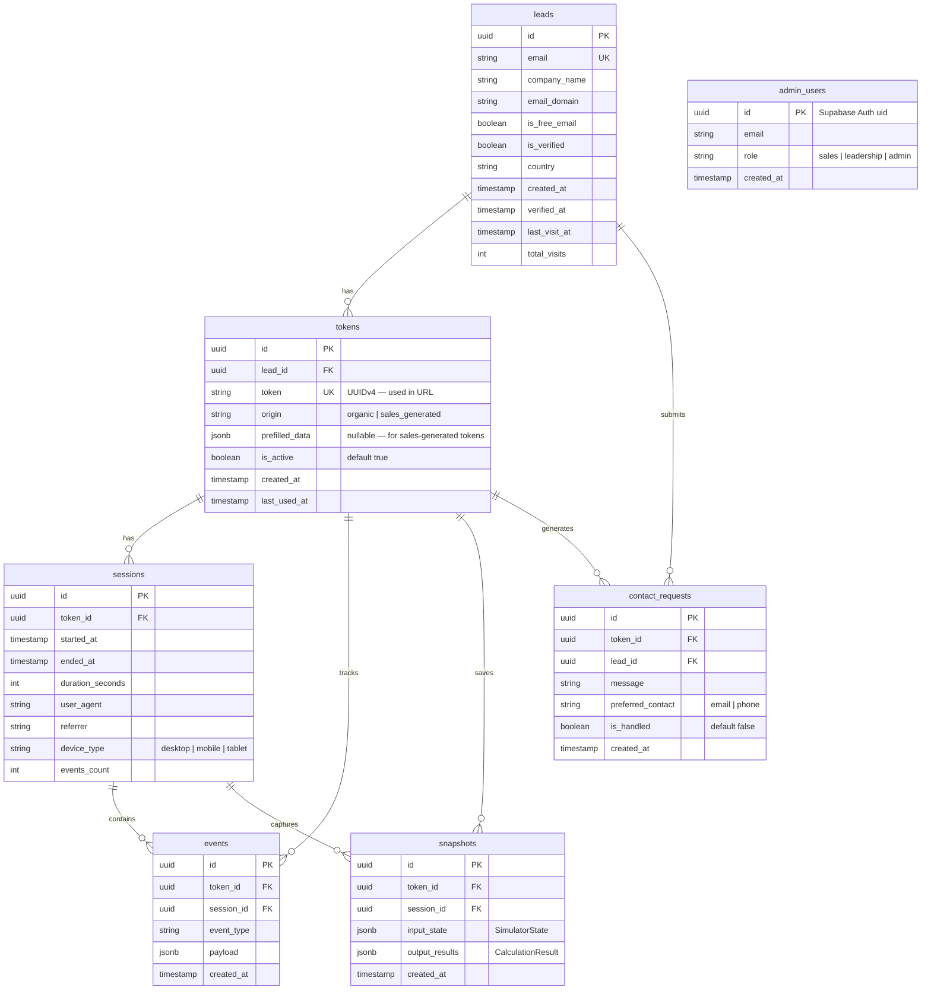

# feat: Build Tether Revenue Simulator Product

## Overview

Transform the existing Revenue Simulator HTML prototype into a production standalone web application for Tether. The product serves as a lead-magnet tool that shows EV Charge Point Operators (CPOs) their potential revenue from Tether's two revenue streams (e-credits + grid flexibility), while capturing structured data on every interaction for sales intelligence and market research.

The application has three pillars: (1) an interactive calculator for CPOs, (2) a tokenised access system with magic-link email verification, and (3) a data & intelligence layer powering an admin dashboard for Tether's sales and leadership teams (see brainstorm: `docs/brainstorms/2026-03-08-tether-revenue-simulator-product-brainstorm.md`).

## Problem Statement

Tether needs to convert CPO prospects into customers. The current approach relies on static presentations and manual outreach. There is no scalable mechanism to:

1. **Demonstrate value** — CPOs are skeptical of startup revenue projections (industry research finding). A transparent, interactive calculator builds trust.
2. **Capture lead data** — No systematic way to identify interested CPOs, their fleet sizes, countries, or engagement levels.
3. **Prioritize sales effort** — Without engagement signals, the sales team treats all prospects equally.
4. **Understand the market** — No aggregate data on CPO fleet compositions, utilization rates, or geographic distribution.

The existing Revenue Simulator HTML prototype (`Concept - The Revenue Simulator.html`) has a proven calculation engine, interactive inputs, and visualizations. It needs to be productized with authentication, data persistence, analytics, and an admin interface.

## Proposed Solution

A Next.js application with Supabase backend, deployed as a standalone web app. Two distinct user experiences:

**CPO-facing:** Landing page → magic-link email verification → tokenised calculator access → PDF export → Contact Sales CTA.

**Tether-facing:** Admin dashboard with two views — sales (lead scoring, engagement signals, pipeline) and leadership (aggregate market intelligence, fleet distributions).

---

## Technical Approach

### Architecture

```
┌─────────────────────────────────────────────────────────┐
│                    Next.js App Router                     │
│                                                           │
│  ┌──────────────┐  ┌──────────────┐  ┌────────────────┐ │
│  │  (public)     │  │  (simulator) │  │  (admin)       │ │
│  │  Landing page │  │  Calculator  │  │  Dashboard     │ │
│  │  Email gate   │  │  Results     │  │  Lead list     │ │
│  │  Magic link   │  │  Charts      │  │  Analytics     │ │
│  │  verify       │  │  PDF export  │  │  Data export   │ │
│  └──────┬───────┘  └──────┬───────┘  └──────┬─────────┘ │
│         │                  │                  │           │
│  ┌──────┴──────────────────┴──────────────────┴─────────┐│
│  │              Next.js API Routes (/api)                ││
│  │  /api/auth/request-link   POST email→magic link      ││
│  │  /api/auth/verify         GET  verify magic link     ││
│  │  /api/tokens/create       POST admin creates token   ││
│  │  /api/events/track        POST batch event ingestion ││
│  │  /api/reports/pdf         POST generate PDF          ││
│  │  /api/admin/leads         GET  lead list + scores    ││
│  │  /api/admin/analytics     GET  aggregate metrics     ││
│  │  /api/admin/export        GET  CSV export            ││
│  └──────────────────────┬───────────────────────────────┘│
└─────────────────────────┼────────────────────────────────┘
                          │
                ┌─────────┴──────────┐
                │   Supabase         │
                │                    │
                │  ┌──────────────┐  │
                │  │  Postgres DB │  │
                │  │  - leads     │  │
                │  │  - tokens    │  │
                │  │  - sessions  │  │
                │  │  - events    │  │
                │  │  - snapshots │  │
                │  │  - admins    │  │
                │  └──────────────┘  │
                │                    │
                │  ┌──────────────┐  │
                │  │  Auth        │  │
                │  │  (admin only)│  │
                │  └──────────────┘  │
                │                    │
                │  ┌──────────────┐  │
                │  │  Storage     │  │
                │  │  (PDFs)      │  │
                │  └──────────────┘  │
                └────────────────────┘
```

**Key architectural decisions (see brainstorm):**
- Next.js App Router with route groups: `(public)`, `(simulator)`, `(admin)`
- Supabase for database, admin auth, and file storage (PDFs)
- CPO auth is custom (magic-link verification + URL access tokens), NOT Supabase Auth — simpler, no password, bookmarkable URLs
- **Token terminology:** Three distinct tokens exist in this system:
  - **Magic link code** (`verification_code`): one-time code sent via email, expires after use. Used in `/api/auth/verify?code=xxx`.
  - **Access token** (`access_token`): persistent UUIDv4 identifier in the calculator URL (`/sim/t/{access_token}`). Never expires. This is what CPOs bookmark.
  - **Session cookie**: `httpOnly` cookie set after magic link verification, maps browser to access token for return visits.
- Admin auth uses Supabase Auth (email/password for Tether team members)
- Event tracking: client-side batching → `POST /api/events/track` → Supabase insert
- PDF generation: server-side using `@react-pdf/renderer` for consistent branded output

### Project Structure

```
tether-revenue-simulator/
├── src/
│   ├── app/
│   │   ├── (public)/                    # Landing page, email gate
│   │   │   ├── page.tsx                 # Landing page with value prop + email form
│   │   │   └── verify/page.tsx          # Magic link verification handler
│   │   ├── (simulator)/
│   │   │   └── sim/t/[token]/page.tsx   # Calculator (token-gated)
│   │   ├── (admin)/
│   │   │   ├── layout.tsx               # Admin layout with auth guard
│   │   │   ├── dashboard/page.tsx       # Main dashboard (sales view)
│   │   │   ├── analytics/page.tsx       # Market intelligence (leadership view)
│   │   │   ├── leads/[id]/page.tsx      # Individual lead detail
│   │   │   └── tokens/page.tsx          # Token management (create, view, revoke)
│   │   ├── api/
│   │   │   ├── auth/
│   │   │   │   ├── request-link/route.ts
│   │   │   │   └── verify/route.ts
│   │   │   ├── tokens/
│   │   │   │   └── create/route.ts
│   │   │   ├── events/
│   │   │   │   └── track/route.ts
│   │   │   ├── reports/
│   │   │   │   └── pdf/route.ts
│   │   │   └── admin/
│   │   │       ├── leads/route.ts
│   │   │       ├── analytics/route.ts
│   │   │       └── export/route.ts
│   │   ├── layout.tsx
│   │   └── globals.css
│   ├── components/
│   │   ├── calculator/
│   │   │   ├── CalculatorForm.tsx       # Input controls (sliders, dropdowns, toggles)
│   │   │   ├── ResultsHero.tsx          # Total revenue, split, per-charger
│   │   │   ├── SeasonalChart.tsx        # 12-month bar/line chart
│   │   │   ├── CumulativeTimeline.tsx   # 12/24-month cumulative area chart
│   │   │   ├── LossCounter.tsx          # "Leaving X on the table" callout
│   │   │   ├── MethodologyPanel.tsx     # Expandable "See the Math"
│   │   │   └── ContactSalesCTA.tsx      # Primary conversion CTA
│   │   ├── admin/
│   │   │   ├── LeadTable.tsx            # Sortable/filterable lead list
│   │   │   ├── EngagementScore.tsx      # Score badge with breakdown
│   │   │   ├── FleetDataTable.tsx       # Aggregate fleet intelligence
│   │   │   ├── MetricsCards.tsx         # KPI summary cards
│   │   │   └── CountryDistribution.tsx  # Geographic breakdown chart
│   │   ├── landing/
│   │   │   ├── HeroSection.tsx          # Value prop + email form
│   │   │   ├── SocialProof.tsx          # Trust indicators
│   │   │   └── FeatureHighlights.tsx    # What the calculator shows
│   │   └── pdf/
│   │       └── RevenueReport.tsx        # @react-pdf/renderer template
│   ├── lib/
│   │   ├── calculator/
│   │   │   ├── engine.ts               # Core calculation logic (ported from HTML)
│   │   │   ├── market-data.ts           # MARKET_DATA constants per country
│   │   │   ├── constants.ts             # PROFILES, ECREDIT, RES_SEASONAL, HOURS_PER_MONTH
│   │   │   └── types.ts                # SimulatorState, CalculationResult types
│   │   ├── db/
│   │   │   ├── supabase.ts             # Supabase client (server + client)
│   │   │   ├── queries.ts              # Database query functions
│   │   │   └── schema.sql              # Database schema (reference)
│   │   ├── tracking/
│   │   │   ├── tracker.ts              # Client-side event batcher
│   │   │   └── events.ts               # Event type definitions
│   │   ├── tokens/
│   │   │   ├── generate.ts             # Token generation (UUIDv4)
│   │   │   └── validate.ts             # Token lookup + validation
│   │   ├── scoring/
│   │   │   └── engagement.ts           # Lead scoring algorithm
│   │   └── utils/
│   │       ├── email.ts                # Email validation + free provider detection
│   │       └── format.ts               # Number/currency formatting
│   └── middleware.ts                    # Token validation for /sim/t/* routes
├── supabase/
│   └── migrations/
│       └── 001_initial_schema.sql       # Database migration
├── public/
│   └── fonts/                           # Inter + Playfair Display (self-hosted)
├── package.json
├── next.config.ts
├── tailwind.config.ts
└── .env.local                           # Supabase URL, anon key, service role key
```

### Implementation Phases

#### Phase 1: Foundation (Week 1)

**Goal:** Project scaffolding, database schema, token system, and landing page.

**Tasks:**

- [ ] Initialize Next.js project with App Router, TypeScript, Tailwind CSS
- [ ] Set up Supabase project (Postgres DB, Auth for admin, Storage for PDFs)
- [ ] Configure environment variables (`.env.local`)
- [ ] Create database schema and run initial migration (see ERD below)
- [ ] Implement access token generation: `crypto.randomUUID()` → UUIDv4 access tokens (persistent, used in URLs)
- [ ] Implement magic-link email flow:
  - `POST /api/auth/request-link` — validates email, creates lead record, generates access token + one-time verification code, sends magic link email via Resend
  - `GET /api/auth/verify?code=xxx` — verifies one-time code (expires after first use), sets `httpOnly` session cookie mapping to access token, redirects to `/sim/t/{access_token}`
- [ ] Implement email validation utility: format check + free provider detection (flag gmail, yahoo, hotmail, etc. as `is_free_email: true`)
- [ ] Build landing page `(public)/page.tsx`:
  - Value proposition section (why CPOs should use this tool)
  - Email capture form (company name + business email)
  - "Check your email" confirmation state after submission
- [ ] Implement Next.js middleware for `/sim/t/*` routes: validate access token from URL, check session cookie, redirect to landing if invalid or revoked
- [ ] Set up Tether brand design tokens in Tailwind config (colors, fonts, typography scale from existing prototype)
- [ ] Self-host Inter + Playfair Display fonts via `next/font`

**Deliverable:** Landing page → email → magic link → verified token → redirect to calculator URL (calculator page is a placeholder at this point).

---

#### Phase 2: Core Calculator (Week 2)

**Goal:** Port the calculation engine and build the interactive calculator UI.

**Tasks:**

- [ ] Port calculation engine from `Concept - The Revenue Simulator.html` lines 1296-1423 into TypeScript:
  - `src/lib/calculator/engine.ts` — pure function `calculateRevenue(state: SimulatorState): CalculationResult`
  - `src/lib/calculator/market-data.ts` — `MARKET_DATA` object with monthly prices per country
  - `src/lib/calculator/constants.ts` — `PROFILES`, `ECREDIT`, `RES_SEASONAL`, `HOURS_PER_MONTH`
  - `src/lib/calculator/types.ts` — TypeScript interfaces for state and results
- [ ] Build `CalculatorForm.tsx` with interactive controls:
  - Company name (text input, pre-filled from lead record)
  - Country (dropdown: Sweden, Norway, Germany, Netherlands, France)
  - Charger type (toggle: Public / Residential — updates defaults on switch)
  - Number of chargers (range slider: 10–10,000, step 10, default 500)
  - Power per charger (dropdown: 7.4 kW / 11 kW / 22 kW, default 11 kW)
  - Utilization rate (range slider: 5–40%, step 1%, default from profile)
  - Flexibility potential (range slider: 20–80%, step 5%, default from profile)
  - All sliders show current value label and have direct number input fallback for mobile
- [ ] Build `ResultsHero.tsx` — total annual revenue, e-credit/flexibility split bars, per-charger figure
- [ ] Build `SeasonalChart.tsx` using Recharts — 12-month grouped bar chart showing e-credits + flexibility per month
- [ ] Build `CumulativeTimeline.tsx` using Recharts — area chart with 12/24-month toggle, gap annotation, cumulative totals
- [ ] Build `LossCounter.tsx` — "In {horizon} months, {company} is leaving EUR {X} on the table" with animated counter
- [ ] Build `MethodologyPanel.tsx` — expandable/collapsible "See the Math" section showing:
  - E-credits formula with labeled variables
  - Flexibility formula with market allocation breakdown
  - Data source links (Mimer, Green Grid Compass)
  - CPO share explanation (40%)
  - Country data quality badge: "Real market data" (Sweden) vs. "Estimated" (others)
- [ ] Wire calculator state: `useState` for `SimulatorState`, `useMemo` for `CalculationResult`, live updates on every input change
- [ ] Load saved calculator state from database for returning users (if snapshot exists for this token)
- [ ] Save calculator state to database on meaningful changes (debounced, 2s after last input change)
- [ ] Mobile-responsive layout: single column below 900px, touch-friendly slider targets (min 44px), direct number entry alongside sliders

**Deliverable:** Fully interactive calculator matching the existing prototype's functionality, running at `/sim/t/{token}`.

---

#### Phase 3: Event Tracking & Analytics (Week 2-3)

**Goal:** Instrument every interaction and build the data pipeline.

**Tasks:**

- [ ] Define event types in `src/lib/tracking/events.ts`:

```typescript
type EventType =
  // Identity
  | 'lead.created'
  | 'lead.verified'
  // Engagement
  | 'session.started'
  | 'session.ended'
  | 'page.viewed'
  // Interaction
  | 'input.changed'        // payload: { field, old_value, new_value }
  | 'profile.switched'     // payload: { from, to }
  | 'horizon.toggled'      // payload: { months }
  // Methodology
  | 'methodology.expanded'
  | 'methodology.collapsed'
  // Conversion
  | 'pdf.exported'
  | 'contact_sales.clicked'
  | 'results.shared'
```

- [ ] Build client-side event batcher `src/lib/tracking/tracker.ts`:
  - Queue events in memory
  - Debounce `input.changed` events: only fire after 500ms of slider inactivity
  - Batch send every 5 seconds OR on `visibilitychange` (tab switch/close) OR when queue reaches 20 events
  - `POST /api/events/track` with array of events
  - Fire-and-forget: tracking failures must never block the calculator UI
  - Include `token_id`, `session_id`, `timestamp`, `event_type`, `payload` per event
- [ ] Build `POST /api/events/track` API route:
  - Validate token exists
  - Bulk insert events into `events` table
  - Rate limit: max 100 events per request, max 10 requests per minute per token
- [ ] Add tracking hooks to all calculator components:
  - `CalculatorForm` → `input.changed` on every debounced input change
  - `MethodologyPanel` → `methodology.expanded` / `methodology.collapsed`
  - `CumulativeTimeline` → `horizon.toggled`
  - Page load → `session.started` with `page.viewed`
  - Page unload → `session.ended` with duration
- [ ] Build `session.started` / `session.ended` lifecycle tracking:
  - `session.started`: timestamp, referrer, user agent (for device type), token_id
  - `session.ended`: timestamp, duration, events_count
- [ ] Implement calculator state snapshot: save full `SimulatorState` + `CalculationResult` to `snapshots` table on PDF export and on session end

**Deliverable:** Every CPO interaction captured in Supabase. Events queryable by token, type, and time range.

---

#### Phase 4: PDF Export (Week 3)

**Goal:** Generate branded, personalized PDF revenue reports.

**Tasks:**

- [ ] Build PDF template with `@react-pdf/renderer` in `src/components/pdf/RevenueReport.tsx`:
  - **Page 1: Executive Summary**
    - Tether logo + branding header
    - "Revenue Estimate for {Company Name}"
    - Date generated
    - Total annual revenue (large, prominent)
    - E-credits vs. flexibility split with percentage bars
    - Revenue per charger per year
    - Key assumptions table (charger count, type, country, utilization, flexibility)
  - **Page 2: Detailed Breakdown**
    - Seasonal revenue chart (render as PNG via Recharts → `recharts-to-png` → embed in PDF)
    - Cumulative timeline chart (same approach)
    - Revenue by market sub-category (mFRR UP/DOWN, FCR-D UP/DOWN, e-credits)
  - **Page 3: Methodology**
    - E-credits formula with explanation
    - Flexibility formula with market allocation
    - Data sources and market context
    - Country data quality note
  - **Footer on all pages:** "Generated by Tether Revenue Simulator | {date} | tetherev.io"
  - **CTA footer on last page:** "Ready to unlock this revenue? Contact us at {sales email}"
- [ ] Build `POST /api/reports/pdf` API route:
  - Accept `token_id` in request body
  - Fetch latest snapshot for this token from database
  - Render PDF using `@react-pdf/renderer`
  - Store PDF in Supabase Storage (for admin access)
  - Return PDF as download response
  - Track `pdf.exported` event
- [ ] Add "Download Report" button to calculator results section
- [ ] File naming: `Tether_Revenue_Estimate_{CompanyName}_{Date}.pdf`

**Deliverable:** CPOs can download a polished, branded PDF of their revenue estimate.

---

#### Phase 5: Admin Dashboard — Sales View (Week 3-4)

**Goal:** Build internal dashboard for Tether's sales team. Leadership analytics deferred to post-MVP Phase 2.

**Tasks:**

- [ ] Set up Supabase Auth for admin users (email/password, invite-only)
- [ ] Build admin layout `(admin)/layout.tsx` with auth guard (redirect to login if unauthenticated)
- [ ] Build **Sales Dashboard** — `(admin)/dashboard/page.tsx`:
  - **Lead table** (`LeadTable.tsx`): sortable by engagement score, last visit, company name
    - Columns: Company, Email, Country, Chargers, Type, Engagement Score, Last Visit, Visits, PDF Exported, Contact Sales Clicked
    - Row click → lead detail page
    - Free-email indicator badge (flag non-business emails)
    - Token origin indicator: "Organic" (email-gated) vs. "Sales-generated"
  - **KPI cards** (`MetricsCards.tsx`): total leads, leads this week, avg engagement score, PDF export rate, Contact Sales click rate
- [ ] Build **Lead Detail** — `(admin)/leads/[id]/page.tsx`:
  - Full lead profile: company, email, country, fleet data
  - Engagement timeline: chronological list of all events
  - Calculator snapshots: what inputs did they use? What results did they see?
  - PDF downloads: links to generated PDFs
- [ ] Build **Token Management** — `(admin)/tokens/page.tsx`:
  - Create sales-generated token: admin fills in company name, country, charger count, charger type → generates URL
  - List all tokens: organic vs. sales-generated, active/revoked status
  - Revoke token: deactivate a token (redirect to landing page if accessed)
  - Copy shareable link button
- [ ] Build **Data Export** — `GET /api/admin/export`:
  - CSV export with columns: email, company, country, charger_count, charger_type, power_kw, utilization, engagement_score, first_visit, last_visit, total_visits, pdf_exported, contact_sales_clicked, token_origin
  - Date range filter
- [ ] Build **Engagement Scoring Algorithm** — `src/lib/scoring/engagement.ts`:

```
Score = Σ (event_weight × recency_decay)

Event weights:
  session.started:        1
  input.changed:          2  (capped at 10 per session)
  methodology.expanded:   5
  pdf.exported:           10
  contact_sales.clicked:  20

Recency decay:
  Last 7 days:   1.0x
  8-14 days:     0.75x
  15-30 days:    0.50x
  31-60 days:    0.25x
  60+ days:      0.10x
```

- [ ] Empty state design: when no leads exist, show onboarding content with instructions for sharing the calculator link and creating sales tokens

**Deliverable:** Tether sales team can view leads, engagement scores, manage tokens, and export data.

**Deferred to post-MVP Phase 2 (Leadership Analytics):**
- Fleet intelligence (aggregate charger counts by country, type distribution, average fleet size)
- Country distribution chart
- Engagement funnel (visitors → verified → calculator → PDF → Contact Sales)
- Utilization rate distribution
- Trend lines (leads per week, engagement over time)
- Lead detail notes field
- Real-time activity feed (Supabase Realtime)
- Admin role-based views (sales vs. leadership)

---

#### Phase 6: Contact Sales CTA (Week 4)

**Goal:** Implement the primary conversion action. (Decision deferred during brainstorm — use placeholder CTA approach for MVP.)

**Tasks:**

- [ ] Build `ContactSalesCTA.tsx` as a prominent button in the results section
- [ ] On click: open a modal with a simple contact form:
  - Pre-filled: company name, email (from token/lead record), country, charger count
  - User adds: message/question (free text), preferred contact method (email/phone)
  - Submit → store in `contact_requests` table → send notification email to Tether sales
- [ ] Track `contact_sales.clicked` event on button click (before form opens)
- [ ] Track `contact_sales.submitted` event on form submission
- [ ] Send notification to Tether (email to configured sales address, or Slack webhook if configured)
- [ ] Show confirmation: "Thanks! Our team will reach out within 24 hours."

**Deliverable:** CPOs can request sales contact directly from the calculator. Tether is notified immediately.

---

#### Phase 7: Polish, GDPR, and Launch Prep (Week 4)

**Goal:** Production readiness.

**Tasks:**

- [ ] Cookie consent banner: minimal, GDPR-compliant
  - Session cookie (token) classified as "strictly necessary" — no consent required
  - Analytics tracking requires consent — show banner on first visit
  - Store consent in cookie + `events` table
  - If consent denied: calculator works, but no analytics events are tracked
- [ ] Privacy policy page: data collected, purpose, retention, rights (DSAR), Supabase as processor
- [ ] Rate limiting on all public API routes:
  - `/api/auth/request-link`: max 5 requests per email per hour, max 20 per IP per hour
  - `/api/events/track`: max 10 requests per minute per token
  - `/api/reports/pdf`: max 5 per token per hour
- [ ] Invalid token handling: `/sim/t/invalid` → redirect to landing page with message "This link is invalid or expired. Enter your email to get access."
- [ ] Error states for all API interactions:
  - Magic link send failure → "Something went wrong. Please try again."
  - Event tracking failure → silent (fire-and-forget, never blocks UI)
  - PDF generation failure → "Report generation failed. Please try again."
- [ ] Edge case handling for calculator:
  - Minimum charger count: 10 (below this, revenue is trivially small)
  - If revenue per charger < EUR 10/year, show contextual note: "This configuration produces minimal revenue. Consider adjusting your inputs."
- [ ] Mobile testing: verify all sliders work on touch, charts are readable, PDF download works
- [ ] Performance: ensure calculator updates are instant (< 16ms for `calculateRevenue`)
- [ ] Deploy to Vercel (or similar) with Supabase connection
- [ ] Configure custom domain (e.g. `simulator.tetherev.io` or similar)
- [ ] Obtain and apply Tether brand assets (logo, colors, fonts) — replace prototype design tokens if different

**Deliverable:** Production-ready application.

---

### Database Schema (ERD)



**Key relationships:**
- A **lead** (CPO) has one or more **tokens** (one organic + potentially one sales-generated)
- A **token** has many **sessions** (each visit creates a session)
- A **session** contains many **events** (every interaction)
- A **token** has many **snapshots** (calculator state captures)
- Duplicate email handling: if a lead re-submits the same email, return the existing lead record and send a new magic link for their existing token

---

## Alternative Approaches Considered

(See brainstorm: `docs/brainstorms/2026-03-08-tether-revenue-simulator-product-brainstorm.md`, "Why This Approach")

1. **Full-Featured Launch (6-8 weeks):** Include scenario comparison, real-time data, PDF v2 at launch. Rejected: delays data collection flywheel.
2. **Data Platform First:** Heavy backend analytics with lean calculator. Rejected: CPO-facing experience must be compelling enough to generate usage data.
3. **Static HTML with analytics overlay:** Keep the HTML prototype and add analytics via a third-party tool (Mixpanel, PostHog). Rejected: no token system, no magic link verification, no admin dashboard, no PDF export.

---

## System-Wide Impact

### Interaction Graph

```
CPO enters email → API creates lead record → sends magic link email (Supabase/Resend)
CPO clicks magic link → API verifies token → sets session cookie → redirects to calculator
CPO interacts with calculator → client batches events → API inserts into events table
CPO exports PDF → API fetches snapshot → renders PDF → stores in Supabase Storage → returns file
CPO clicks Contact Sales → modal form → API stores contact_request → sends notification to sales
Admin views dashboard → API queries leads + events + snapshots → aggregates scores → returns data
Admin creates sales token → API creates token with prefilled_data → returns shareable URL
```

### Error Propagation

- **Magic link email failure:** User sees "Something went wrong. Please try again." Retry is safe (idempotent — same lead record, new magic link).
- **Event tracking failure:** Silent. Client discards failed batch. No retry. Calculator continues working.
- **PDF generation failure:** User sees error toast. Can retry. Server logs error for debugging.
- **Supabase outage:** Calculator still renders (calculation is client-side), but no events tracked, no PDF export, no state persistence. Degrade gracefully.

### State Lifecycle Risks

- **Partial lead creation:** If lead is created but magic link fails to send, lead exists in DB with `is_verified: false`. Next submission for same email will find existing record and re-send link. Safe.
- **Orphaned sessions:** If `session.ended` event is never sent (user closes tab before `visibilitychange` fires), session remains open. Mitigation: background job to close sessions older than 24 hours.
- **Stale snapshots:** Calculator state is debounce-saved. If user changes inputs and immediately closes tab, last 2s of changes may be lost. Acceptable for MVP.

### API Surface Parity

- CPO-facing routes: `(public)/*` and `(simulator)/*` — public and token-gated respectively
- Admin routes: `(admin)/*` — Supabase Auth gated
- API routes: `/api/*` — mixed (some public with rate limiting, some admin-only)
- No mobile app, no third-party API consumers in v1

### Integration Test Scenarios

1. **Full CPO journey:** Landing → email → magic link → verify → calculator → change inputs → export PDF → click Contact Sales → form submit. Verify: lead record, token, session, events (all types), snapshot, contact_request, PDF in storage.
2. **Return visit:** Verified CPO returns via bookmarked token URL → calculator loads with saved state → new session created → events tracked under same token.
3. **Sales-generated token:** Admin creates token with prefilled data → CPO clicks link → calculator shows prefilled values → no email gate → events tracked → admin sees lead in dashboard with "Sales-generated" badge.
4. **Duplicate email:** CPO submits same email twice → same lead record returned → new magic link sent → same token used → no data fragmentation.
5. **Invalid token:** Visit `/sim/t/nonexistent` → middleware redirects to landing page with error message.

---

## Acceptance Criteria

### Functional Requirements

- [ ] CPO can enter email on landing page and receive a magic link
- [ ] Clicking magic link creates verified session and redirects to calculator
- [ ] Calculator displays all 7 input controls with correct ranges and defaults
- [ ] Calculator updates results in real-time (< 100ms) on any input change
- [ ] Results show: total revenue, e-credit/flexibility split, per-charger figure, seasonal chart, cumulative timeline, loss counter
- [ ] "See the Math" section expands to show full calculation methodology
- [ ] Country data quality is clearly labeled: "Real market data" (Sweden) vs. "Estimated" (others)
- [ ] PDF export generates a branded 3-page report matching the template spec
- [ ] Contact Sales CTA opens pre-filled form and submits contact request
- [ ] Returning users (via bookmarked token URL) see their saved calculator state
- [ ] Admin can log in and view lead list with engagement scores
- [ ] Admin can view aggregate analytics (fleet data, country distribution, engagement funnel)
- [ ] Admin can create sales-generated tokens with pre-filled CPO data
- [ ] Admin can revoke tokens
- [ ] Admin can export lead data as CSV
- [ ] Sales-generated token links provide direct calculator access without email gate
- [ ] All CPO interactions are tracked as events in the database
- [ ] Free email providers are flagged in the admin lead list

### Non-Functional Requirements

- [ ] Calculator computation completes in < 16ms (60fps rendering)
- [ ] Page load time < 3 seconds on 3G connection
- [ ] Event tracking never blocks the calculator UI (fire-and-forget)
- [ ] Token entropy: UUIDv4 (128-bit random) — not enumerable
- [ ] Rate limiting on all public API endpoints
- [ ] GDPR-compliant cookie consent before analytics tracking
- [ ] Privacy policy accessible from landing page and calculator
- [ ] Mobile-responsive: all features work on 375px+ screen width
- [ ] Accessible: WCAG 2.1 AA for interactive elements, keyboard navigation, chart alt text

### Quality Gates

- [ ] Unit tests for calculation engine (verify formulas match existing HTML prototype output)
- [ ] Integration tests for token lifecycle (create → verify → use → return visit)
- [ ] Integration tests for event tracking pipeline (client → API → database)
- [ ] E2E test for full CPO journey (landing → email → verify → calculator → PDF)
- [ ] Admin dashboard renders correctly with 0 leads (empty state) and 100+ leads

---

## Success Metrics

(See brainstorm: `docs/brainstorms/2026-03-08-tether-revenue-simulator-product-brainstorm.md`, "Success Metrics")

| Metric | Definition | Target |
|--------|-----------|--------|
| Lead capture rate | Unique emails submitted / unique landing page visitors | > 15% |
| Verification rate | Magic links clicked / magic links sent | > 60% |
| Calculator completion rate | Users who view results / verified users | > 80% |
| Return visit rate (7d) | Users who return within 7 days / verified users | > 10% |
| Methodology engagement | Users who expand "See the Math" / verified users | > 20% |
| PDF export rate | Users who export PDF / verified users | > 15% |
| Contact Sales rate | Users who click CTA / verified users | > 5% |
| Data richness | Avg events per user session | > 10 |

---

## Dependencies & Prerequisites

| Dependency | Status | Blocker? |
|-----------|--------|----------|
| Tether brand assets (logo, colors, fonts) | Pending from client | No (can use prototype design tokens as fallback) |
| Supabase project setup | Not started | Yes (Phase 1) |
| Custom domain (e.g. simulator.tetherev.io) | Not started | No (can launch on Vercel default domain) |
| GDPR legal review | Not started | Soft blocker for production launch |
| Email sending service (Resend) | Not started | Yes (Phase 1 — magic links) |
| Tether sales email address for notifications | Pending from client | No (can configure later) |

---

## Risk Analysis & Mitigation

| Risk | Likelihood | Impact | Mitigation |
|------|-----------|--------|-----------|
| Low CPO engagement (< 5% lead capture) | Medium | High | A/B test landing page copy; offer instant preview before email gate |
| Magic link emails land in spam | Medium | High | Use dedicated email domain; configure SPF/DKIM/DMARC; test with major providers |
| Calculator results feel inaccurate to CPOs | Medium | High | Transparency layer ("See the Math") + country data quality badges + disclaimers |
| Supabase free tier limits reached | Low | Medium | Monitor usage; upgrade plan if needed; Supabase free tier supports 500MB DB + 50K auth users |
| GDPR non-compliance at launch | Medium | High | Implement cookie consent + privacy policy before any real CPO traffic; flag as launch blocker |
| Token URL sharing (CPO shares link with others) | Low | Low | Acceptable for MVP — all interactions still attributed to same company |

---

## Future Considerations

(See brainstorm: `docs/brainstorms/2026-03-08-tether-revenue-simulator-product-brainstorm.md`, "Enhancement Roadmap")

**Phase 2 (Month 2-3):** Leadership analytics dashboard, scenario comparison, PDF report v2 with multiple styles
**Phase 3 (Month 3-4):** Real-time market data from Mimer API, peer benchmarking
**Phase 4 (Month 4+):** CRM integration, API access, historical tracking, fleet optimization suggestions

**Architecture for future-proofing:**
- Market data hardcoded in `market-data.ts` for MVP. In Phase 3, migrate to a `market_data` database table to enable live data updates from Mimer API
- Event schema is extensible (JSONB payload) to support new event types without migration
- Admin roles support future RBAC expansion
- Snapshot storage enables historical tracking in Phase 4

---

## Documentation Plan

- [ ] `README.md` — Project setup, environment variables, development workflow
- [ ] `CLAUDE.md` — Project conventions, architecture decisions, file patterns for AI-assisted development
- [ ] Database schema documented in `supabase/migrations/001_initial_schema.sql` with comments
- [ ] API routes documented with request/response examples in code comments
- [ ] Engagement scoring algorithm documented in `src/lib/scoring/engagement.ts`

---

## Sources & References

### Origin

- **Brainstorm document:** [docs/brainstorms/2026-03-08-tether-revenue-simulator-product-brainstorm.md](docs/brainstorms/2026-03-08-tether-revenue-simulator-product-brainstorm.md) — Key decisions carried forward: Token-First MVP approach, Next.js + Supabase stack, email-gated tokenised access, all-countries launch, sales + leadership admin dashboard.

### Internal References

- Existing calculation engine: `Concept - The Revenue Simulator.html:1296-1423` (JavaScript calculation logic)
- Market data constants: `Concept - The Revenue Simulator.html:1303-1343` (MARKET_DATA per country)
- Design system: `Concept - The Revenue Simulator.html:9-35` (CSS custom properties, color palette)
- Input controls: `Concept - The Revenue Simulator.html:956-1014` (form fields, ranges, steps)
- URL parameter support: `Concept - The Revenue Simulator.html:1672-1707` (pre-fill via URL params)
- Competitor research: `Competitor_LeadMagnet_Research.md` (15+ competitor tools analyzed)
- Industry research: `Industry Research - Tether CPO Market Overview.md` (market context, CPO challenges)
- Earlier brainstorm: `docs/brainstorms/2026-02-28-tether-cpo-lead-magnet-brainstorm.md` (Concept A/B analysis)

### External References

- Supabase Auth docs: https://supabase.com/docs/guides/auth
- Supabase Realtime: https://supabase.com/docs/guides/realtime
- Next.js App Router: https://nextjs.org/docs/app
- @react-pdf/renderer: https://react-pdf.org/
- Recharts: https://recharts.org/
- iron-session: https://github.com/vvo/iron-session

### Decisions Made During Planning (Not in Brainstorm)

- **Email verification:** Magic link verification (adds friction but ensures data quality). Brainstorm said "accept all emails" — updated based on planning discussion.
- **Sales-generated tokens:** Direct access without email gate. Sales knows who they sent to; no need to re-capture email.
- **Contact Sales CTA:** Placeholder approach for MVP — embedded modal form with pre-filled data. Tether can decide between form / Calendly / mailto later.
- **Token format:** UUIDv4 via `crypto.randomUUID()` — 128-bit entropy, not enumerable.
- **Event batching:** Client-side batch every 5s, debounce slider events at 500ms, fire-and-forget.
- **PDF approach:** Server-side via `@react-pdf/renderer` with chart PNGs embedded via `recharts-to-png`.
- **Engagement scoring:** Weighted sum with recency decay. Configurable weights stored in algorithm, not database (simplicity for MVP).
